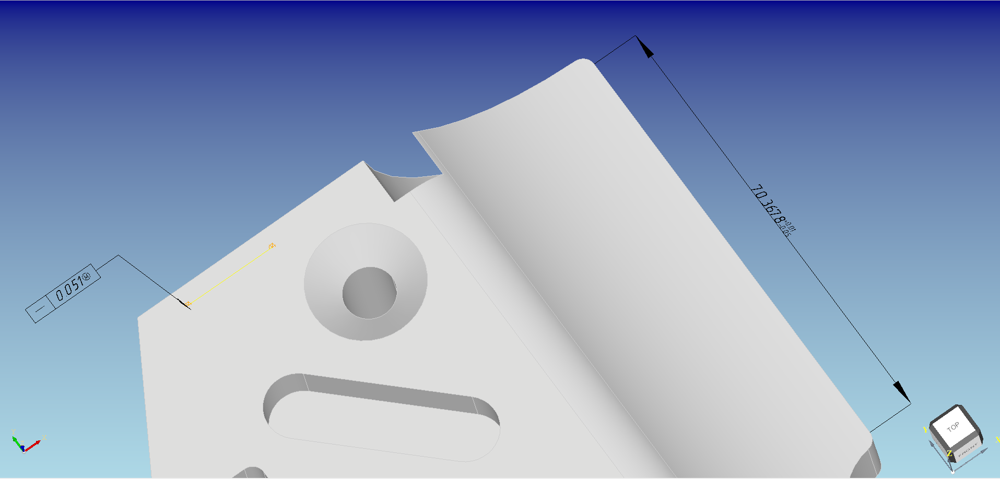
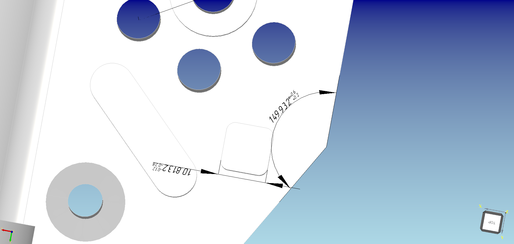
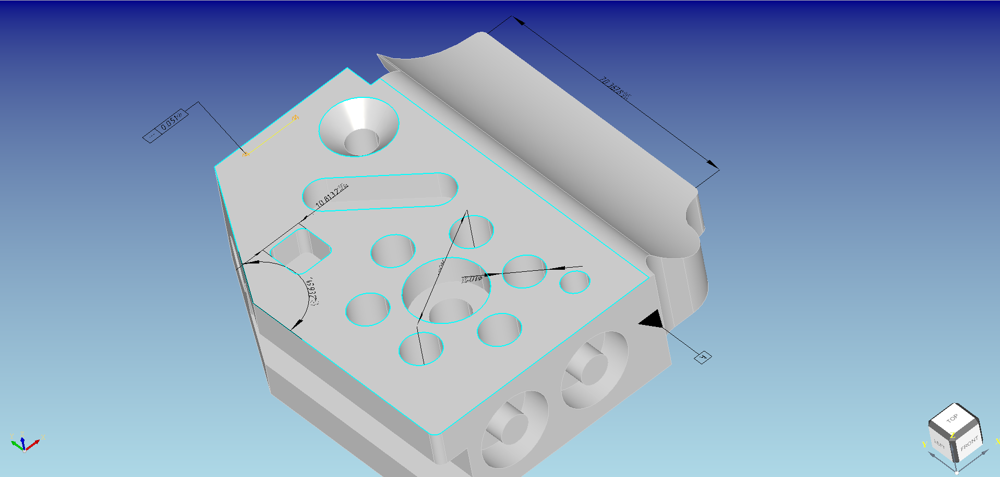

# PMIAnnotation
A simple tool for displaying annotation of PMI information, based on the OpenCasCade library

include tolerence|diamension|datum

Steps of drawing a label in OpenCasCade environment:

(1) Draw the text on plane XOY. For those special symbols, use Font_BRepFont and your *.fft file to draw the shape of text;

(2) Transform the half-formed label to the target position. gp_Ax2 is used to represent that. The function gp_Trsf::SetTransformation is very help to calculate the transform between the two position;

(3) You can easily get the start and end position of label, then draw the lead wire with them.

(4) To make these labels draggable, you only need to ensure that all label classes inherit from the same abstract class, deal with the abstract class in widget's mouse event.